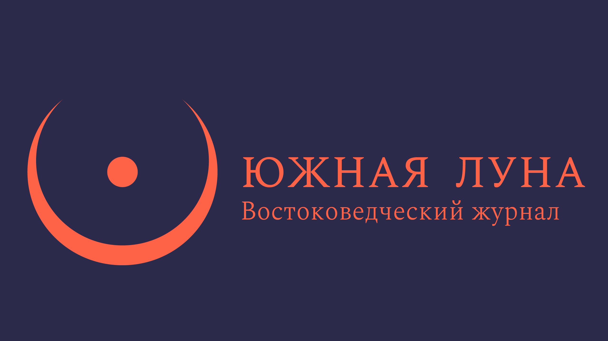
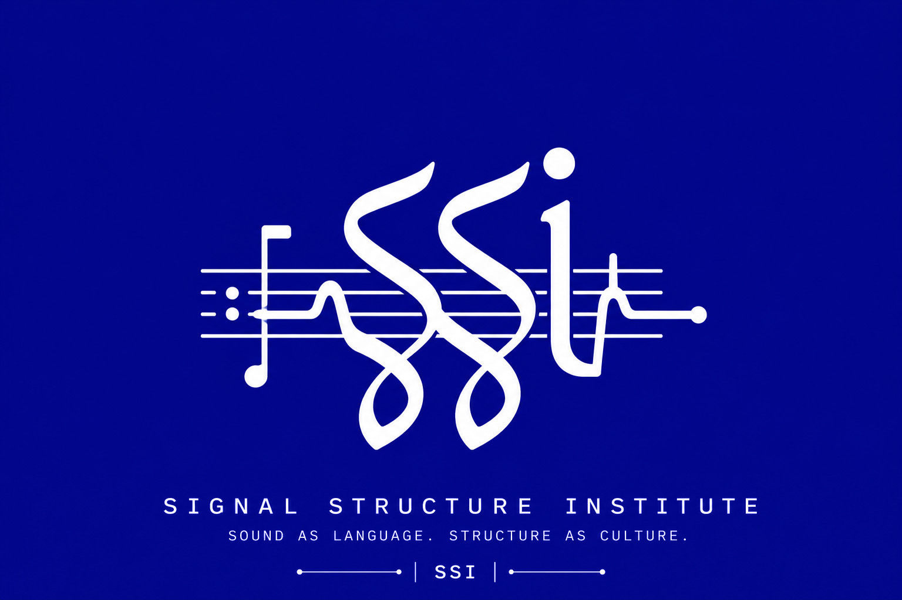
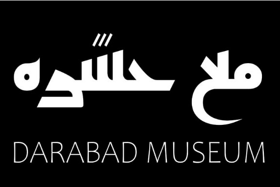

## Георгий Корытин
Графический художник, дизайнер.

## Некоторые работы

### Обо мне

Мой основной фокус это визуальный дизайн, айдентика, UI/UX (делал лого, типографику, вёрстку, раскадровки, плакаты, разработку концептов и подобное).

### Владею
##### Классика
От 5 до 9 лет работаю в:
- Figma;
- Adobe Illustrator, Photoshop/Gimp;
- Krita, Toon Boom (рисование + анимация);
##### ИИ
- Claude Opus 4.8, Chat GPT Pro 5.5, (создание, редактирование, настройка контекста и проч.);
- ComfyUI, FLUX.1 Dev, Stable Diffusion XL, Nanobanana 2, Dall-E 3, (генерация изображений);
- Hugging Face, OpenRouter Images (агрегаторы и ресерч).

### Опыт 
 
 Проучился 7 лет и закончил с отличием художественную школу «Параллели» по направлению «Арт-дизайн».
##### Навыки и квалификация
- Основы визуализации интерфейсов и 
веб-приложений;
- Понимание композиции и перспективы;
- Ретушь;
- Теория цветокоррекции;
- И много всего ещё.
##### Разрабатывал визуальное содержание для
- Ежемесячный журнал Esquire;
- Союз Российских предпринимателей;
- Востоковедческий журнал «Южная Луна»;
- Исследовательский портал «Zietgeist»;
- Музей дикой природы «Darabad museum»;
- Исследовательский институт «Structure signal institute»;
- Промышленная компания «Форматум».

